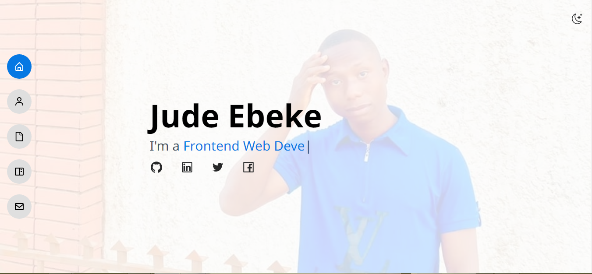
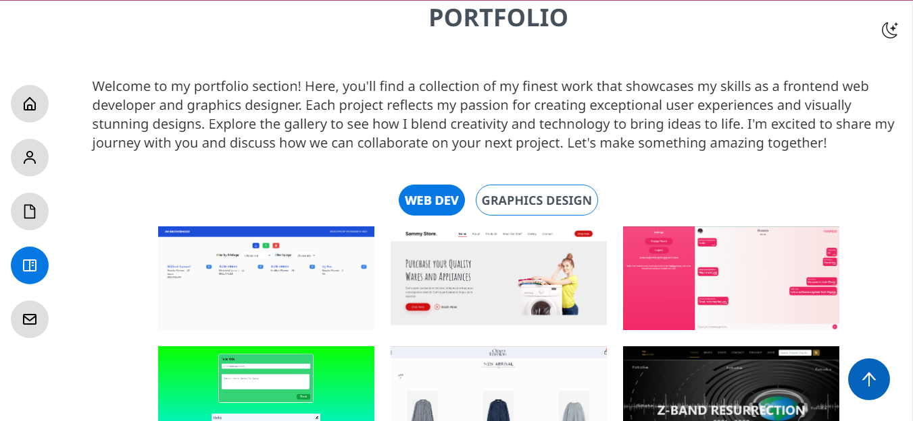
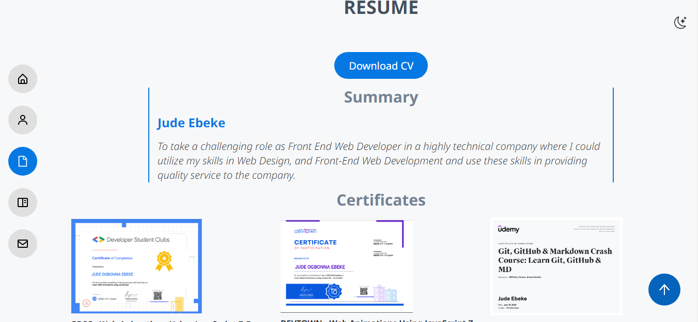

# Portfolio Site

Welcome to my portfolio site! This repository contains the code and assets for my personal portfolio website.

## Table of Contents

- [Description](#description)
- [Features](#features)
- [Technologies Used](#technologies-used)
- [Installation](#installation)
- [Usage](#usage)
- [Demo](#demo)
- [Screenshots](#screenshots)
- [License](#license)
- [Contact](#contact)

## Description

This portfolio site showcases my skills, projects, and experiences as a Frontend Web Developer professional. It provides a visually appealing and interactive way for visitors to learn more about me and my work.

## Features

- About Me: A brief introduction about myself, my background, and my skills.
- Projects: Highlighted projects with descriptions, links, and screenshots.
- Contact: Contact form for visitors to get in touch with me.
- Responsive Design: Ensures the site looks and works well on various devices.

## Technologies Used

- HTML5, CSS3, JavaScript
- React, Tailwind CSS
- Vite, NPM

## Installation

1. Clone this repository: `git clone https://github.com/judeebeke/my-react-vite-site.git`
2. Navigate to the project directory: `cd portfolio-site`
3. Install any dependencies run `npm install`

## Usage

1. Customize the content in the HTML and CSS files to match your information and style.
2. Replace the placeholder project details and images with your own projects.
3. If applicable, update any configuration files or settings.

## Demo

Demo is unavailable!

## Screenshots

## Contact

- Website: https://ebekesjude.vercel.app
- LinkedIn: https://www.linkedin.com/in/jude-ebeke-b67813223
- Facebook: https://www.facebook.com/profile.php?id=100070522303715
- Email: judeebekes67@gmail.com
- Twitter/X: https://mobile.twitter.com/techie_genie
